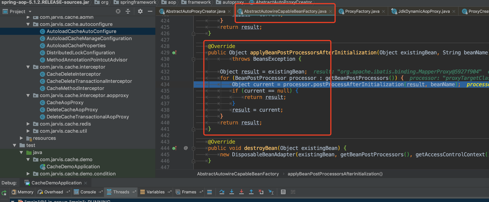
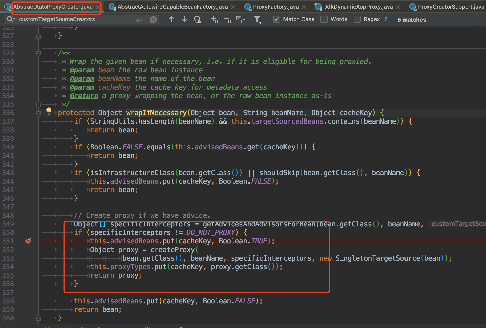

# autoload-cache-spring-boot-starter AOP执行两次原因

原因和 [https://blog.csdn.net/wangjun5159/article/details/51824171](https://blog.csdn.net/wangjun5159/article/details/51824171) 中的一样，是因为被代理了两次。

通过跟踪下面代码：

会发现，AspectJAwareAdvisorAutoProxyCreator 和 DefaultAdvisorAutoProxyCreator 两个代理创建者创建代理。

